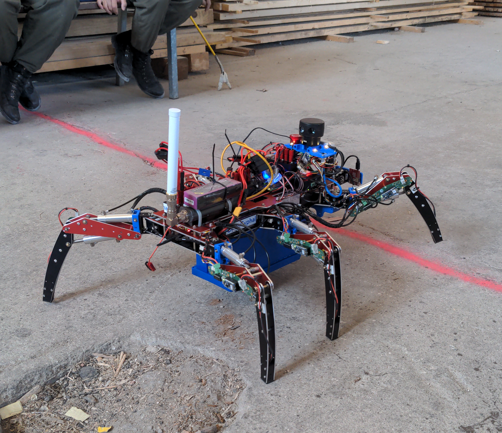

<a href="https://107-systems.org/"></a>
L3X-Z
=====
[](https://github.com/107-systems/l3xz/actions/workflows/spell-check.yml)

This is the digital home of **L3X-Z** ([*lɛɡz*](https://en.wiktionary.org/wiki/legs)), a mixed **electric/hydraulic hexapod robot**.

All software components are built to leverage [ROS2 Humble Hawksbill](https://docs.ros.org/en/foxy/Releases.html).

All real-time intravehicular communication is provided via [Cyphal](https://opencyphal.org/) / [CAN](https://en.wikipedia.org/wiki/CAN_bus) using [107-Arduino-Cyphal](https://github.com/107-systems/107-Arduino-Cyphal).

<p align="center">
  <a href="https://github.com/107-systems/l3xz"></a>
</p>

#### Video

<p align="center">
  <a href="https://107-systems.org/elrob-2022/2022-05-31-ELROB-2022-Alex-02-compressed.mp4"></a>
</p>

#### Articles
* A. Entinger (2023, January). [Building a legged robot in 80 days: Lessons learned, tears shed, blood spilled](https://107-systems.org/l3xz-hexapod-robot-elrob2022).

#### How-to-build
```bash
cd $COLCON_WS/src
git clone https://github.com/107-systems/l3xz
cd $COLCON_WS
source /opt/ros/humble/setup.bash
colcon build --packages-select l3xz
```

#### How-to-run
**L3X-Z Hexapod Robot**
```bash
cd $COLCON_WS
. install/setup.bash
ros2 launch l3xz robot.py
```

**Control Station**
```bash
cd $COLCON_WS
. install/setup.bash
ros2 launch l3xz control.py
```

#### Repositories
##### Host Software
* [l3xz_joy](https://github.com/107-systems/l3xz_joy): ROS PS3 joystick driver for feeding `l3xz_teleop` node.
* [l3xz_teleop](https://github.com/107-systems/l3xz_teleop): Teleoperation for L3X-Z via PS3 joystick and ROS topics.
* [l3xz_mapping](https://github.com/107-systems/l3xz_mapping): L3X-Z mapping stack.
* [l3xz_frontend](https://github.com/107-systems/l3xz_frontend): Web based frontend for L3X-Z.
* [l3xz_frontend_base](https://github.com/107-systems/l3xz_frontend_base): Fundamental functionalities for frontends using roslibjs.
##### Robot Software
* [ros2_cyphal_bridge](https://github.com/107-systems/ros2_cyphal_bridge): Interface between [ROS](https://github.com/ros2) and [L3X-Z](https://github.com/107-systems/l3xz)'s [Cyphal](https://opencyphal.org) connected components.
* [ros2_dynamixel_bridge](https://github.com/107-systems/ros2_dynamixel_bridge): Interface between [ROS2](https://github.com/ros2) and [L3X-Z](https://github.com/107-systems/l3xz)'s Robotis Dynamixel servos.
* [l3xz_gait_ctrl](https://github.com/107-systems/l3xz_gait_ctrl): Gait controller for the L3X-Z electric/hydraulic hexapod robot.
* [l3xz_head_ctrl](https://github.com/107-systems/l3xz_head_ctrl): Head controller for the L3X-Z electric/hydraulic hexapod robot.
##### Firmware
* [l3xz-aux-ctrl-firmware](https://github.com/107-systems/l3xz-aux-ctrl-firmware): Firmware for the [L3X-Z](https://github.com/107-systems/l3xz) auxiliary controller ([OpenCyphalPicoBase](https://github.com/generationmake/OpenCyphalPicoBase)).
* [l3xz-leg-ctrl-firmware](https://github.com/107-systems/l3xz-leg-ctrl-firmware): Firmware for the [L3X-Z](https://github.com/107-systems/l3xz) leg controller ([l3xz-leg-ctrl-hardware](https://github.com/107-systems/l3xz-leg-ctrl-hardware)).
* [l3xz-radiation-sensor-firmware](https://github.com/107-systems/l3xz-radiation-sensor-firmware): Firmware for the [L3X-Z](https://github.com/107-systems/l3xz) radiation sensor ([OpenCyphalPicoBase](https://github.com/generationmake/OpenCyphalPicoBase)).
* [l3xz-valve-ctrl-firmware](https://github.com/107-systems/l3xz-valve-ctrl-firmware): Firmware for the [L3X-Z](https://github.com/107-systems/l3xz) radiation sensor ([OpenCyphalServoController12](https://github.com/generationmake/OpenCyphalServoController12)).
##### Hardware
* [l3xz-leg-ctrl-hardware](https://github.com/107-systems/l3xz-leg-ctrl-hardware): L3X-Z Hexapod leg controller hardware design files.
* [RS485-Power-Injector](https://github.com/107-systems/RS485-Power-Injector): Provide battery power to RS485 devices.
* [CAN-Power-Injector](https://github.com/107-systems/CAN-Power-Injector): Provide power via CAN to all L3X-Z CAN devices.
* [PowerPole-Distributor-12](https://github.com/107-systems/PowerPole-Distributor-12): 12 - way power distribution board with Anderson PowerPole® connectors.
##### CAD
* [l3xz-cad](https://github.com/107-systems/l3xz-cad): L3X-Z Hexapod hardware design files (3D model, printed parts, etc.).
##### Dependencies
* [libdynamixelplusplus](https://github.com/107-systems/libdynamixelplusplus): C++17 wrapper for the Robotis Dynamixel servo protocol.
* [orocos-kdl](https://github.com/107-systems/orocos-kdl-debian): Prebuilt Debian package for `aarch64-linux-gnu` and `arm-linux-gnueabihf`.
##### "Dragonbeard" pan/tilt color/thermal imaging head
* **ROS**: [l3xz_openmv_camera](https://github.com/107-systems/l3xz_openmv_camera): ROS driver for [OpenMV](https://openmv.io/) camera.
* **CAD**: [l3xz-hw-pan-tilt-head](https://github.com/107-systems/l3xz-hw-pan-tilt-head): CAD files for L3X-Z's pan/tilt color/thermal imaging head.
* **Docker**: [l3xz-sw-pan-tilt-head](https://github.com/107-systems/l3xz-sw-pan-tilt-head): Software bundle for deployment on the Raspberry Pi Zero 2 of the [pan/tilt head](https://github.com/107-systems/l3xz-hw-pan-tilt-head).
##### Deprecated
* [l3xz_sweep_scanner](https://github.com/107-systems/l3xz_sweep_scanner): ROS driver for Scanse Sweep 360° 2D LIDAR. **Sensor no longer used in L3X-Z.**

### Configuration
#### Network Configuration
| Component | IP | Notes |
|-|:-:|-|
| MikroTik "Base Station" | 192.168.88.2 (Bridge-IP) | (station bridge, nv2, pre-shared-key, l...) |
| MikroTik "Robot" | 192.168.88.1 (Bridge-IP) | (bridge, nv2, pre-shared-key, l...) |
| Robot Rasperry Pi (Ethernet) | 192.168.88.5 | |
| Control PC (Ethernet) | 192.168.88.3 | |
**Note**: MikroTik [RBMetal5SHPn](https://mikrotik.com/product/RBMetal5SHPn).

#### Cyphal Configuration
##### How-to-config via `yakut`
[Install](https://github.com/OpenCyphal/yakut) and configure `yakut`:
```bash
. setup_yakut.sh
```
Dump all write-able registers into `cyphal-config-raw.yaml`:
```bash
y rl 11,12,13,14,15,16,20,30,40,50 | y --yaml rb --only=mp > config/cyphal-config-raw.yaml
```
Format the YAML file for better human readability via [pyyaml](https://pypi.org/project/PyYAML):
```bash
pip install pyyaml
python -c "import sys,yaml;yaml.dump_all(yaml.load_all(sys.stdin, yaml.Loader), sys.stdout)" < config/cyphal-config-raw.yaml | tee config/cyphal-config.yaml
```
Edit to file for your desired network configuration and write back:
```bash
y rb --file=config/cyphal-config.yaml
```
Store configuration into persistent storage and restart.
```bash
y cmd 11,12,13,14,15,16,20,30,40,50 store
y cmd 11,12,13,14,15,16,20,30,40,50 restart
```

##### [`l3xz-leg-ctrl-firmware`](https://github.com/107-systems/l3xz-leg-ctrl-firmware)
| Port ID | [DSDL](https://github.com/OpenCyphal/public_regulated_data_types) Type | Node ID | Type  | Description                           |
|:-------:|:----------------------------------------------------------------------:|:-------:|:-----:|---------------------------------------|
|  1001U  |                 `uavcan::si::unit::angle::Scalar_1_0`                  |   11    |  Pub  | Left/Front   Femur Angle Actual / rad |
|  1002U  |                 `uavcan::si::unit::angle::Scalar_1_0`                  |   11    |  Pub  | Left/Front   Tibia Angle Actual / rad |
|  1003U  |                 `uavcan::primitive::scalar::Bit_1_0`                   |   11    |  Pub  | Left/Front   Tibia Tip Switch         |
|  1004U  |                 `uavcan::si::unit::angle::Scalar_1_0`                  |   12    |  Pub  | Left/Middle  Femur Angle Actual / rad |
|  1005U  |                 `uavcan::si::unit::angle::Scalar_1_0`                  |   12    |  Pub  | Left/Middle  Tibia Angle Actual / rad |
|  1006U  |                 `uavcan::primitive::scalar::Bit_1_0`                   |   12    |  Pub  | Left/Middle  Tibia Tip Switch         |
|  1007U  |                 `uavcan::si::unit::angle::Scalar_1_0`                  |   13    |  Pub  | Left/Back    Femur Angle Actual / rad |
|  1008U  |                 `uavcan::si::unit::angle::Scalar_1_0`                  |   13    |  Pub  | Left/Back    Tibia Angle Actual / rad |
|  1009U  |                 `uavcan::primitive::scalar::Bit_1_0`                   |   13    |  Pub  | Left/Back    Tibia Tip Switch         |
|  1010U  |                 `uavcan::si::unit::angle::Scalar_1_0`                  |   14    |  Pub  | Right/Back   Femur Angle Actual / rad |
|  1011U  |                 `uavcan::si::unit::angle::Scalar_1_0`                  |   14    |  Pub  | Right/Back   Tibia Angle Actual / rad |
|  1012U  |                 `uavcan::primitive::scalar::Bit_1_0`                   |   14    |  Pub  | Right/Back   Tibia Tip Switch         |
|  1013U  |                 `uavcan::si::unit::angle::Scalar_1_0`                  |   15    |  Pub  | Right/Middle Femur Angle Actual / rad |
|  1014U  |                 `uavcan::si::unit::angle::Scalar_1_0`                  |   15    |  Pub  | Right/Middle Tibia Angle Actual / rad |
|  1015U  |                 `uavcan::primitive::scalar::Bit_1_0`                   |   15    |  Pub  | Right/Middle Tibia Tip Switch         |
|  1016U  |                 `uavcan::si::unit::angle::Scalar_1_0`                  |   16    |  Pub  | Right/Front  Femur Angle Actual / rad |
|  1017U  |                 `uavcan::si::unit::angle::Scalar_1_0`                  |   16    |  Pub  | Right/Front  Tibia Angle Actual / rad |
|  1018U  |                 `uavcan::primitive::scalar::Bit_1_0`                   |   15    |  Pub  | Right/Front  Tibia Tip Switch         |

##### [`l3xz-aux-ctrl-firmware`](https://github.com/107-systems/l3xz-aux-ctrl-firmware)
| Port ID | [DSDL](https://github.com/OpenCyphal/public_regulated_data_types) Type | Node ID | Type | Description    |
|:-------:|:----------------------------------------------------------------------:|:-------:|:----:|----------------|
|  2001U  |                  `uavcan::primitive::scalar::Bit_1_0`                  |   20    | Pub  | Emergency Stop |
|  2002U  |               `uavcan::primitive::scalar::Integer8_1_0`                |   20    | Sub  | Light Mode     |

##### [`l3xz-radiation-sensor-firmware`](https://github.com/107-systems/l3xz-radiation-sensor-firmware)
| Port ID |   [DSDL](https://github.com/OpenCyphal/public_regulated_data_types) Type    | Node ID | Type | Description          |
|:-------:|:---------------------------------------------------------------------------:|:-------:|:----:|----------------------|
|  3001U  |         `uavcan::primitive::scalar::Natural16_1_0`                          |   30    | Pub  | Radiation Tick Count |

##### [`l3xz-valve-ctrl-firmware`](https://github.com/107-systems/l3xz-valve-ctrl-firmware)
| Port ID | [DSDL](https://github.com/OpenCyphal/public_regulated_data_types) Type | Node ID | Type | Description            |
|:-------:|:----------------------------------------------------------------------:|:-------:|:----:|------------------------|
|  4001U  |             `uavcan::primitive::array::Natural16_1_0`                  |   40    | Sub  | Servo Pulse Width / us |

##### [Zubax Robotics Orel 20](https://files.zubax.com/products/io.px4.sapog/Zubax_Orel_20_Datasheet.pdf)
| Port ID | [DSDL](https://github.com/OpenCyphal/public_regulated_data_types) Type | Node ID | Type | Description  |
|:-------:|:----------------------------------------------------------------------:|:-------:|:----:|--------------|
|  5001U  |              `reg::udral::service::common::Readiness_0_1`              |   50    | Sub  | Readiness    |
|  5002U  |        `reg::udral::service::actuator::common::sp::Scalar_0_1`         |   50    | Sub  | RPM Setpoint |
